# EN CONSTRUCCIÓN :)

# Basada en la [guía oficial](https://escornabot.org/wiki/index.php/Gu%C3%ADa_de_montaje_(Brivoi))

# Guía Montaje para la versión Escornabot DIY
  
Los componentes detallados los puedes encontrar [aquí](https://github.com/pablorubma/escornabot-DIY#22-componentes-del-cuerpo) y son estos:
  
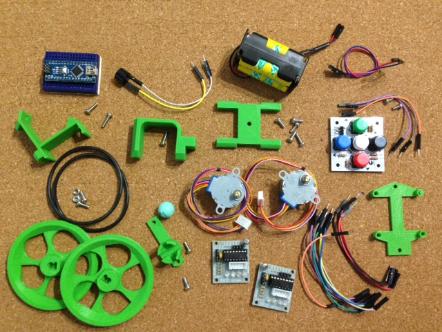
  
## Ensamblaje motores
  
Material necesario:
* *Pieza MotorBracket*
* *2 Motores paso a paso 28BYJ-48 5V (solo los motores los drivers los usaremos más adelante)*
* *4 Tornillos M3 de 10mm*

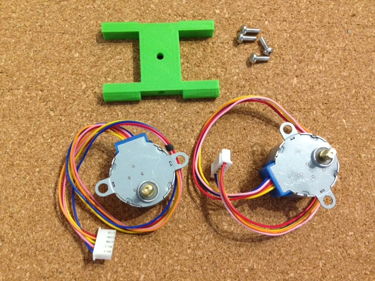
  
Dependiendo de la calidad de las piezas impresas este paso te costará más o menos.

  
>__NOTA: Coloca los motores en la orientación que se muestra en la siguiente imagen, la zona azul en el mismo lado de la pieza donde el agujero central del tornillo tiene una muesca para encajar el tornillo.__
  
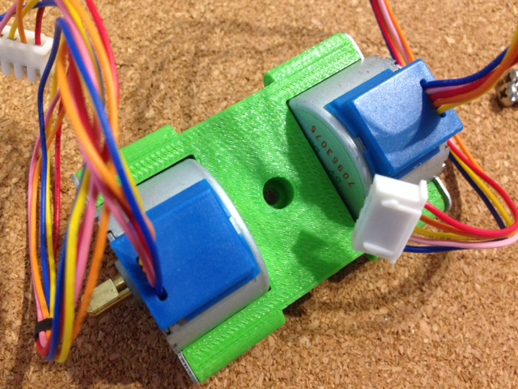
  
## Soporte portapilas-batería

Material necesario:
* *Pieza battery-bracket*
* *1 Tornillo M3 de 10mm*
  
>__NOTA: La pieza va colocada al lado contrario donde quedo la parte azul de los motores como puedes ver en las imágenes.__

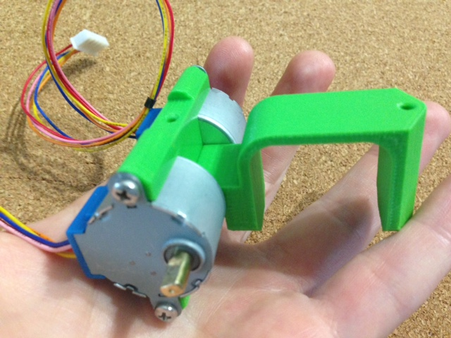

## Soporte placa botonera

Material necesario:
* *Pieza Addon-KeypadBracket-PCB (Ya que estoy utilizando la [placa de XDeSIG](https://github.com/pablorubma/escornabot-DIY#212-versi%C3%B3n-de-xdesig), si fabricamos la [placa totalmente artesanal](https://github.com/pablorubma/escornabot-DIY#211-placa-original-totalmente-artesanal) necesitaremos la pieza Addon-KeypadBracket-5Buttons)*
* *1 Tornillo M3 de 10mm*

>__NOTA: Pondremos solamente el tornillo de la parte trasera como puedes ver en las imágenes__

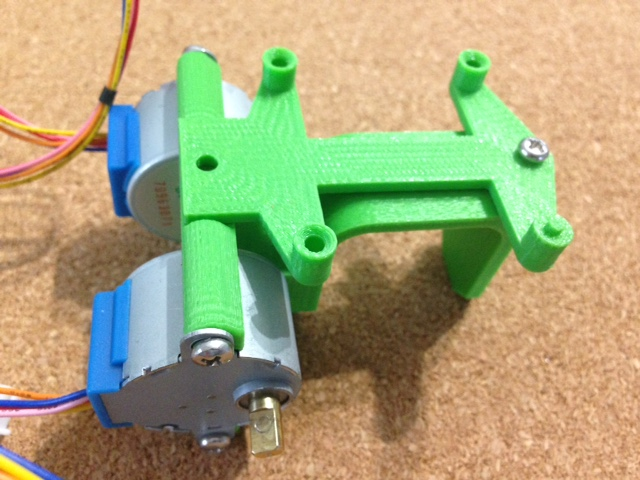
  
## Soporte protoboard 170 puntos

Material necesario:
* *Pieza board-bracket*
* *2 Tornillos M3 de 10mm*
  
>__NOTA: La pieza se encaja encima del soporte de la placa botonera y lleva otro tornillo en la parte inferior de los motores (Yo no suelo poner este tornillo porque me queda fijo solo con el superior)__
  
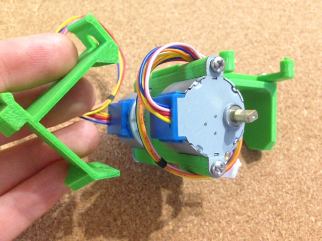
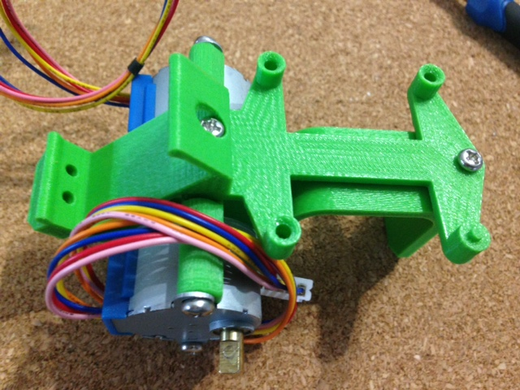
  
## Portapilas y bola

Material necesario:
* *Pieza ballcaster-v2*
* *2 Tornillos M3 de 10mm*
* *Bola o canica de 14mm*
* *Portapilas AA"
* *4 Pilas AA*
  
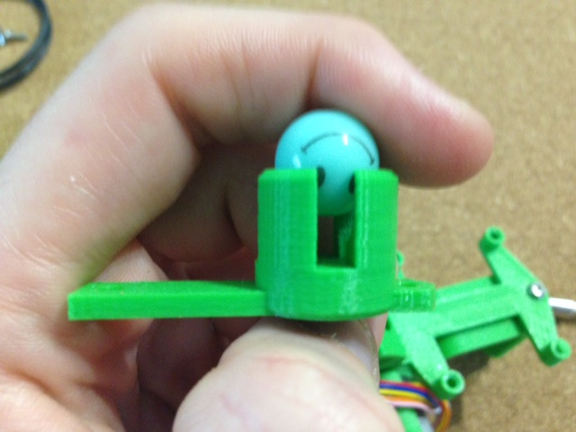  
>__NOTA BOLA: Puede que la bola se salga, lo puedes solucionar calentando un poco la pieza y ajustando al gusto (con cuidado ^_^).__  
  
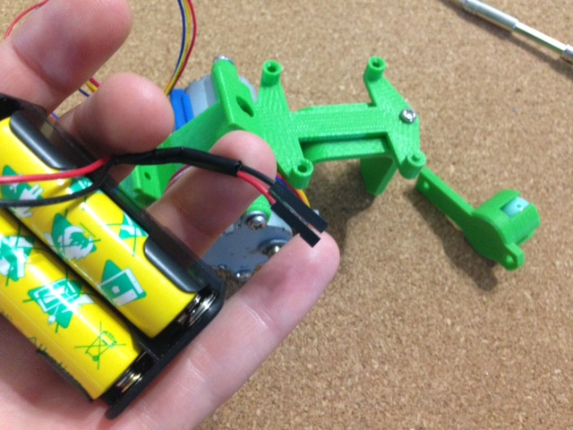
>__NOTA PORTAPILAS: En algunos modelos tienen una posición concreta en la que encajan para no forzar la pieza donde va colocado. No utilizo interruptor, así que empalmo unos terminales hembra para después pinchar en la protoboard (puedes ponerlo de otro modo si quieres ^_^)__  

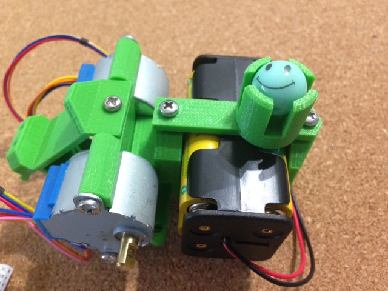
  
>__NOTA PORTAPILAS: Si ves la siguiente imagen en este modelo queda una separación entre las dos piezas y se aprecia un trozo de tornillo. No hace falta ajustar los tornillos a dolor porque te puedes cargar alguna pieza, es suficiente si ajusta y no se mueve.__

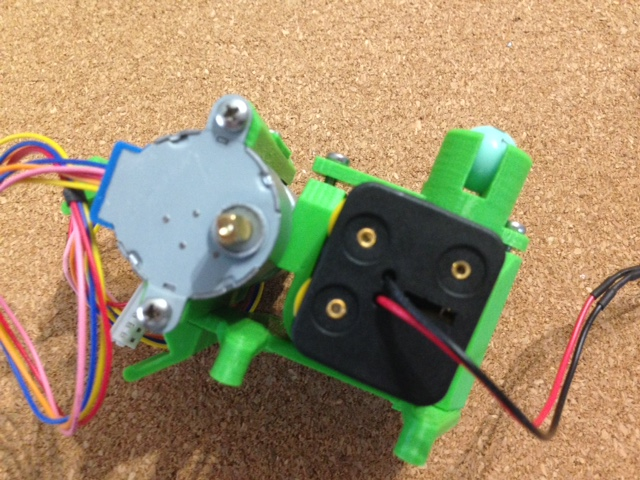
  
## Protoboard 170 puntos

Material necesario:
* *Protoboard*
   
>__NOTA: Al colocar encima el Arduino NANO dejo tres hileras libres en la parte superior y dos en la parte inferior. El único misterio de la protoboard es como todo en la vida, encajarla con cariño ^_^.__ 
  
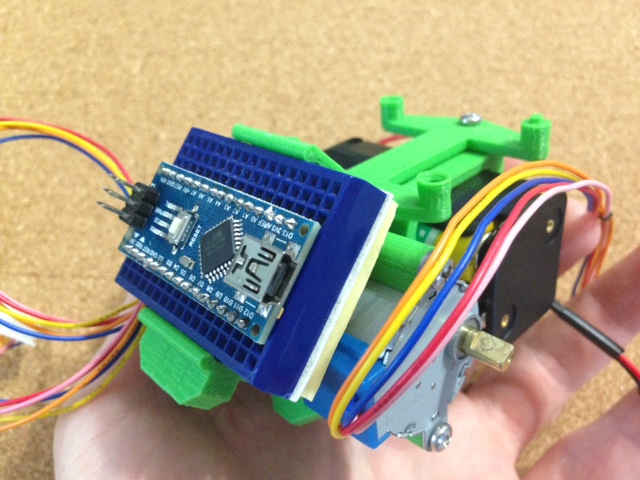 
  
## Drivers para controlar los motores

### Colocación de los drivers

Material necesario:
* *2 Drivers ULN2003*
* *2 Tornillos M3 de 10mm (Puedes usar más corticos)*
  
>__NOTA: Mira en la siguiente imagen como va colacada la placa o te pegará después con las ruedas. Los cuatro pines macho tienen que ir en la parte superior.__ 
  
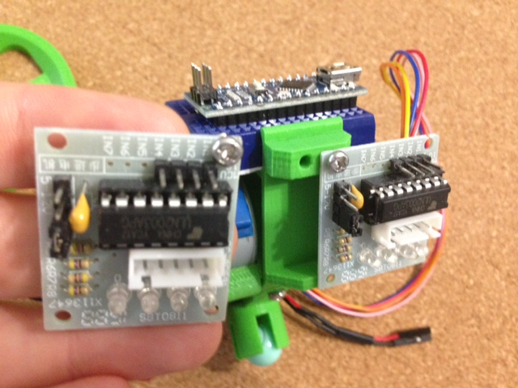
  
>__NOTA: el de la izquierda (mirando la imagen) te quedará un poquito torcido porque pegarán las soldaduras de la parte trasera en la pieza impresa3D.__ 
  
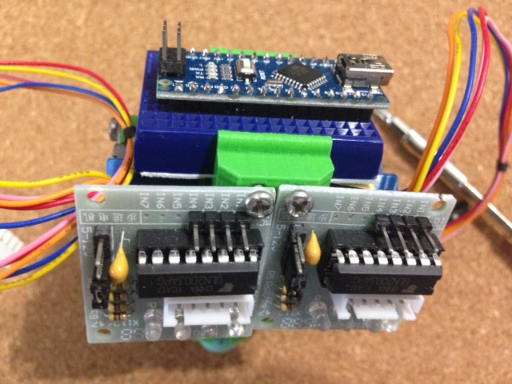
  
>__NOTA: Un truco para que los cables queden recogidos es pasar el cable por el driver contrario tal y como puedes ver en la siguiente imagen.__ 
  

### Colocación cableado de los drivers-protoboard
  
Material necesario:
* *8 cables arduino macho-hembra de 10cm (me gusta usar de colores pero puedes usar los que quieras)*
* *2 cables arduino macho-hembra de 10cm negros (puedes usar de otro color)*
* *2 cables arduino macho-hembra de 10cm rojos (puedes usar de otro color)*
  

>__NOTA: La conexión es fácil, "mirando de frente los drivers" empezamos por los cuatro conectores de arriba, primero el de arriba a la derecha lo pinchamos en el pin D9 y los otros tres a continuación en orden D8, D7, D6.__ 
  
  
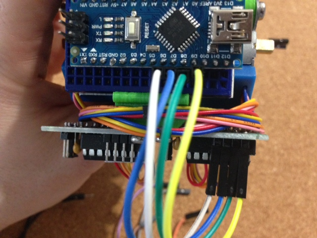
  
>__NOTA: Ahora a por el de la izquierda "mirando de frente los drivers"__ 
  

  
>__NOTA: Vamos a conectar positivo y negativo. Lo tienes marcado en el driver. En este caso el de abajo positivo, el de arriba negativo. Positivo va colocado al pin VIN y el Negativo a GND__

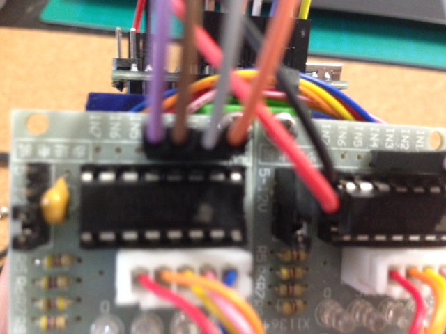  

  
>__NOTA: El resultado final debería ser algo así :P__
  

