# EN CONSTRUCCIÓN :)

# Basada en la [guía oficial](https://escornabot.org/wiki/index.php/Gu%C3%ADa_de_montaje_(Brivoi))

# Guía Montaje para la versión Escornabot DIY
  
Los componentes detallados los puedes encontrar [aquí](https://github.com/pablorubma/escornabot-DIY#22-componentes-del-cuerpo) y son estos:
  

  
## Ensamblaje motores
  
Material necesario:
* *Pieza "MotorBracket"*
* *2 Motores paso a paso 28BYJ-48 5V (solo los motores los drivers los usaremos más adelante)*
* *4 Tornillos M3 de 10mm*

  
Dependiendo de la calidad de las piezas impresas este paso te costará más o menos.

  
>__NOTA: Coloca los motores en la orientación que se muestra en la siguiente imagen, la zona azul en el mismo lado de la pieza donde el agujero central del tornillo tiene una muesca para encajar el tornillo.__
  

  
## Soporte portapilas-batería

Material necesario:
* *Pieza "battery-bracket"*
* *1 Tornillo M3 de 10mm*
  
>__NOTA: La pieza va colocada al lado contrario donde quedo la parte azul de los motores como puedes ver en las imágenes.__

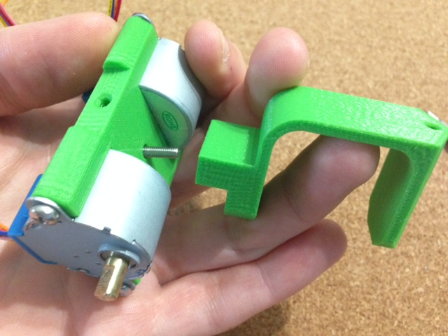

## Soporte placa botonera

Material necesario:
* *Pieza Addon-KeypadBracket-PCB (Ya que estoy utilizando la [placa de XDeSIG](https://github.com/pablorubma/escornabot-DIY#212-versi%C3%B3n-de-xdesig), si fabricamos la [placa totalmente artesanal](https://github.com/pablorubma/escornabot-DIY#211-placa-original-totalmente-artesanal) necesitaremos la pieza Addon-KeypadBracket-5Buttons)*
* *1 Tornillo M3 de 10mm*

>__NOTA: Pondremos solamente el tornillo de la parte trasera como puedes ver en las imágenes__

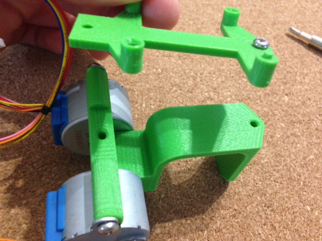

  
## Soporte protoboard 170 puntos

Material necesario:
* *Pieza "board-bracket"*
* *2 Tornillos M3 de 10mm*
  
>__NOTA: La pieza se encaja encima del soporte de la placa botonera y lleva otro tornillo en la parte inferior de los motores (Yo no suelo poner este tornillo porque me queda fijo solo con el superior)__
  

  
## Portapilas y bola

Material necesario:
* *Pieza "ballcaster-v2"*
* *2 Tornillos M3 de 10mm*
* *Bola o canica de 14mm*
* *Portapilas AA"
* *4 Pilas AA*
  
  
>__NOTA BOLA: Puede que la bola se salga, lo puedes solucionar calentando un poco la pieza y ajustando al gusto (con cuidado ^_^).__  
  

>__NOTA PORTAPILAS: En algunos modelos tienen una posición concreta en la que encajan para no forzar la pieza donde va colocado. No utilizo interruptor, así que empalmo unos terminales hembra para después pinchar en la protoboard (puedes ponerlo de otro modo si quieres ^_^)__  

  
>__NOTA PORTAPILAS: Si ves la siguiente imagen en este modelo queda una separación entre las dos piezas y se aprecia un trozo de tornillo. No hace falta ajustar los tornillos a dolor porque te puedes cargar alguna pieza, es suficiente si ajusta y no se mueve.__

  
## Protoboard 170 puntos

Material necesario:
* *Protoboard*
   
>__NOTA: Al colocar encima el Arduino NANO dejo tres hileras libres en la parte superior y dos en la parte inferior. El único misterio de la protoboard es como todo en la vida, encajarla con cariño ^_^.__ 
  
 
  
## Drivers para controlar los motores

### Colocación de los drivers

Material necesario:
* *2 Drivers ULN2003*
* *2 Tornillos M3 de 10mm (Puedes usar más corticos)*
  
>__NOTA: Mira en la siguiente imagen como va colacada la placa o te pegará después con las ruedas. Los cuatro pines macho tienen que ir en la parte superior.__ 
  

  
>__NOTA: el de la izquierda (mirando la imagen) te quedará un poquito torcido porque pegarán las soldaduras de la parte trasera en la pieza impresa3D.__ 
  

  
>__NOTA: Un truco para que los cables queden recogidos es pasar el cable por el driver contrario tal y como puedes ver en la siguiente imagen.__ 
  
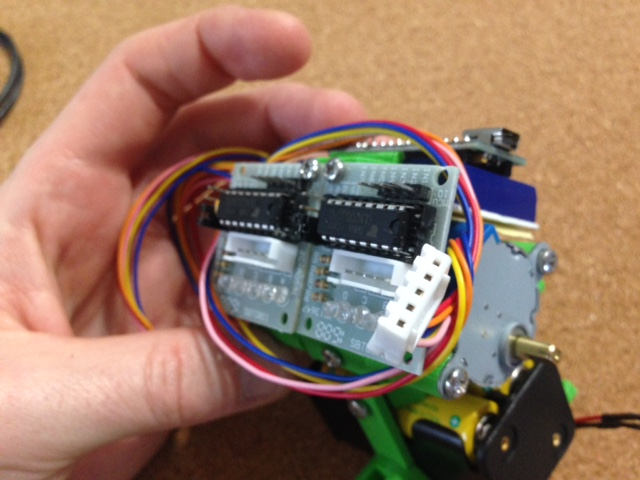

### Colocación cableado de los drivers-protoboard

Puedes consultar la [guía de cableado en la web escornabot](https://escornabot.com/web/es/content/cableado) si te quedas con dudas
  
Material necesario:
* *8 cables arduino macho-hembra de 10cm (me gusta usar de colores pero puedes usar los que quieras)*
* *2 cables arduino macho-hembra de 10cm negros (puedes usar de otro color)*
* *2 cables arduino macho-hembra de 10cm rojos (puedes usar de otro color)*
  
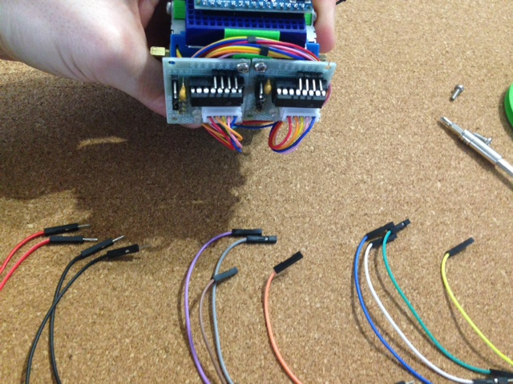

>__NOTA: La conexión es fácil, "mirando de frente los drivers" empezamos por los cuatro conectores de arriba, primero el de arriba a la derecha lo pinchamos en el pin D9 y los otros tres a continuación en orden D8, D7, D6.__ 
  
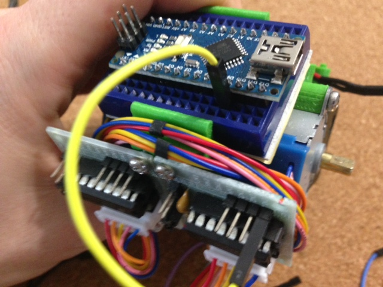  

  
>__NOTA: Ahora a por el de la izquierda "mirando de frente los drivers"__ 
  
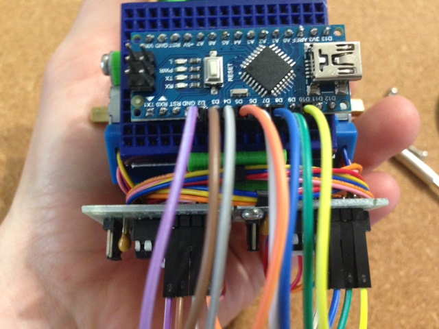
  
>__NOTA: Vamos a conectar positivo y negativo. Lo tienes marcado en el driver. En este caso el de abajo positivo, el de arriba negativo. Positivo va colocado al pin VIN y el Negativo a GND__

  
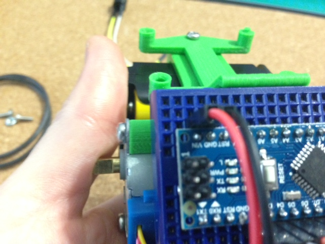
  
>__NOTA: El resultado final debería ser algo así :P__
  
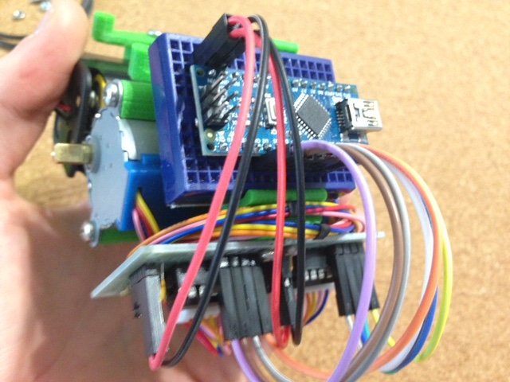
  
## Placa botonera

Material necesario:
* *Placa botonera (da igual si usas [placa de XDeSIG](https://github.com/pablorubma/escornabot-DIY#212-versi%C3%B3n-de-xdesig) o la [placa totalmente artesanal](https://github.com/pablorubma/escornabot-DIY#211-placa-original-totalmente-artesanal))*
* *3 Cables arduino macho-hembra de 10cm*
  
>__IMPORTANTE: Primero realiza el Test de la botonera, tienes todos los pasos a seguir en la guía [comprobación y configuración de las lecturas de la botonera](https://escornabot.com/web/es/content/comprobacion-y-configuracion-de-las-lecturas-de-botonera)__
  
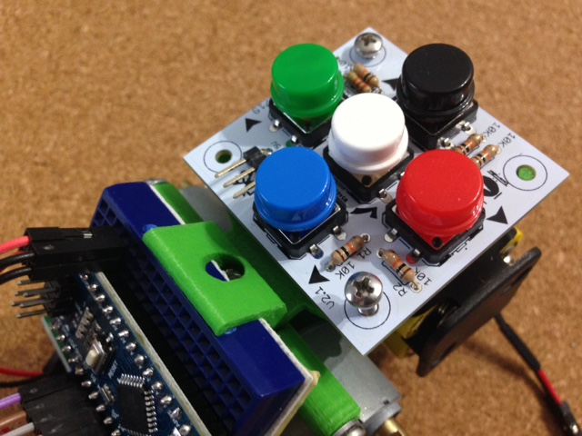
  
>__NOTA: El pin cercano al botón azul es GND, lo coloco en el GND de la parte inferior. El pin central es la conexión de datos, lo coloco en el pin A4 (recuerda revisar el código después para ver que tienes configurado el teclado en este pin). El pin exterior es el positivo y lo conectaremos al pin de 5V__

  
## Buzzer 5V o zumbador

Material necesario:
* *Buzzer 5V*
* *2 Cables arduino macho-hembra de 10cm (me gusta usar uno blanco para negativo y uno amarillo para positivo ^_^)*
  
>__NOTA: Normalmente el positivo va marcado y suele ser la patilla larga. Yo lo pongo con los cablecicos colgando porque me mola, pero aquí free-style.__
  
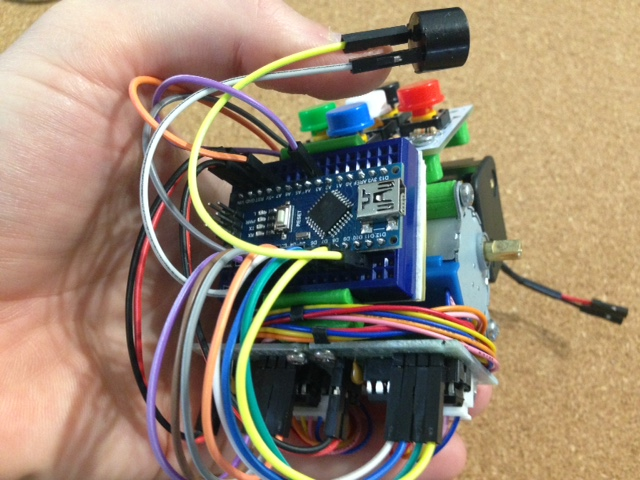

## Ruedas

Material necesario:
* *Pieza "wheel-l"*
* *Pieza "wheel-r"*
* *2 Juntas tóricas 63x60x3mm*
* *2 Tornillos M3 de 10mm*
* *2 Tuercas M3*
  
>__NOTA: La tuerca debería entrar sin forzar mucho, si ves que no encaja siempre puedes tirar de soldador calentar con cuidado y encajar. Una vez encajada coloca el tornillo sin que asome la punta por la tuerca, así después solo tienes que pretar una vez tengas la rueda montada__
  
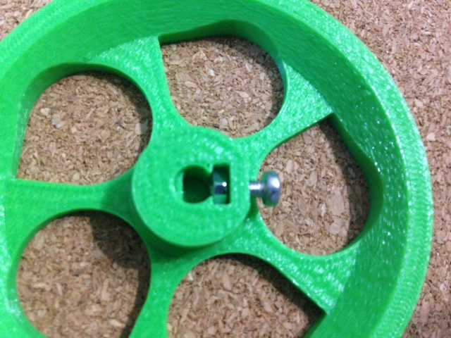
  
>__NOTA: La junta dependiendo del tamaño te costará un poco ponerla pero no hay mayor problema__
  
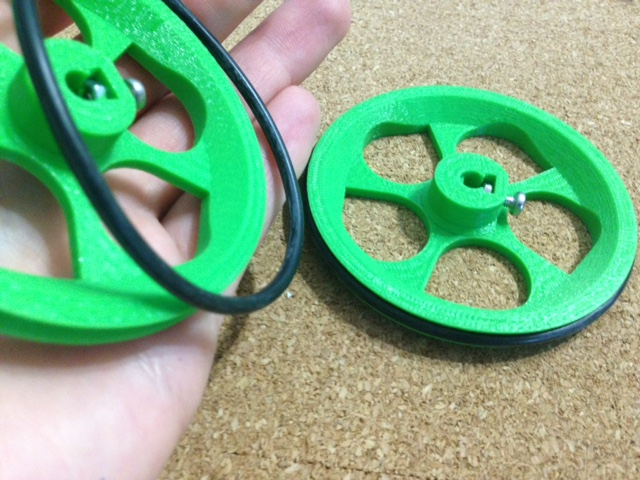
  
>__NOTA: La rueda lleva la forma del engancha con el motor. Una vez puesta, mueve la rueda para que el tornillo te quede en la parte inferior y lo puedas ajustar con facilidad.__
  
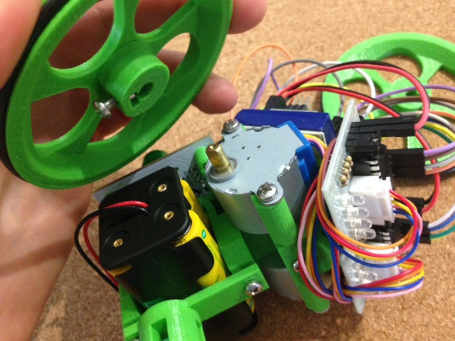  
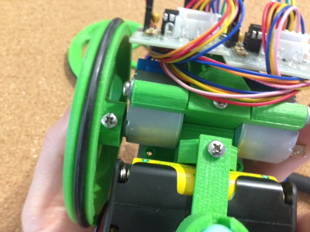  
  
## Conexión cables corriente pilas
  
Material necesario:
* *2 Cables arduino macho-macho 10cm*  
  
*Lo repito, a mi me gusta montarlo así. Puedes ponerle un interruptor o lo que quieras :P*  
  
>__NOTA: Si has dejado tres huecos en la hilera superior como dije al inicio te quedará sitio para poner el positivo en VIN y negativo en GND como puedes ver en la foto.__  
  
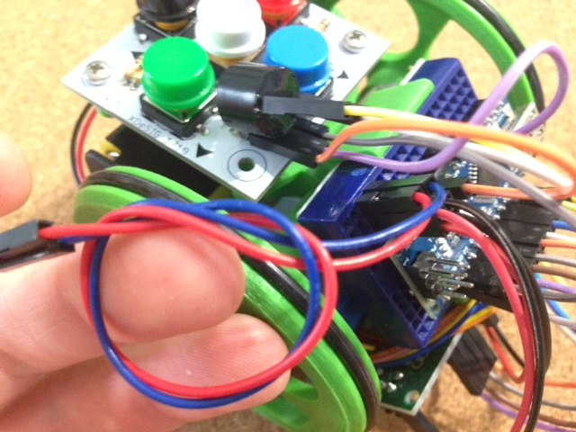  
  
## Carga el código Arduino  
  
Solo te quedará cargar el código, lo tienes explicado [aquí](https://github.com/pablorubma/escornabot-DIY#5-instalaci%C3%B3n-ide-arduino-y-descarga-de-la-programaci%C3%B3n)  
  
# Conecta los cables de corriente con los del portapilas y a JUGAR!!  
  
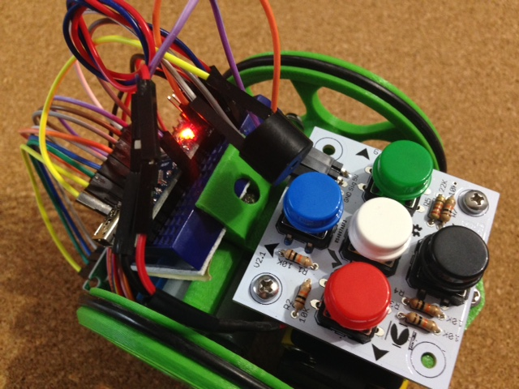
